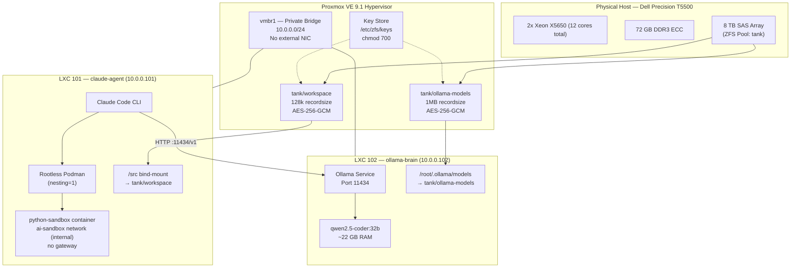
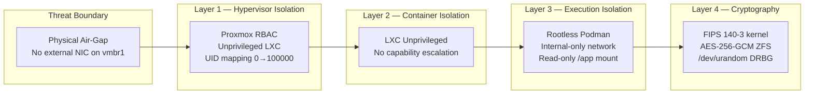
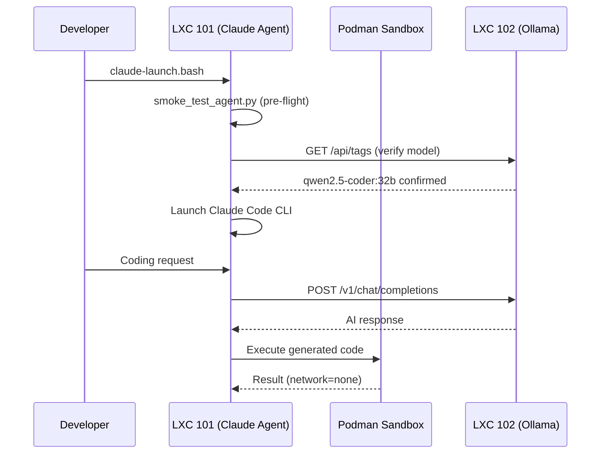

# Architecture Document — Air-Gapped AI Development Station
**Version:** 1.0 | **Updated:** 2026-03-11  
**Compliance:** NIST 800-53 | FIPS 140-3 | CIS Proxmox Level 2

---

## 1. System Overview

---

## 2. Security Architecture

---

## 3. Data Flow

---

## 4. Storage Architecture

| Dataset | Recordsize | Encryption | Purpose |
|---|---|---|---|
| `tank/workspace` | 128 KB | AES-256-GCM | Source code, config, scripts |
| `tank/ollama-models` | 1 MB | AES-256-GCM | LLM model weights (sequential reads) |

ZFS ARC is capped at 16 GB to leave ~50 GB for the 32B model in system RAM.

---

## 5. Network Architecture

| Network | Bridge | Subnet | Gateway | Purpose |
|---|---|---|---|---|
| Internal AI | `vmbr1` | `10.0.0.0/24` | None | LXC-to-LXC communication only |
| Podman Sandbox | `podman1` | `172.16.200.0/24` | None | Complete network isolation for code execution |

---

## 6. Component Inventory

| Component | Version | Location |
|---|---|---|
| Proxmox VE | 9.1 | Physical host |
| Ollama | Latest at sideload | LXC 102 |
| qwen2.5-coder | 32B | LXC 102 via Ollama |
| Claude Code CLI | Latest at sideload | LXC 101 |
| Python | 3.11 | LXC 101 + sandbox |
| Podman | System package | LXC 101 |
