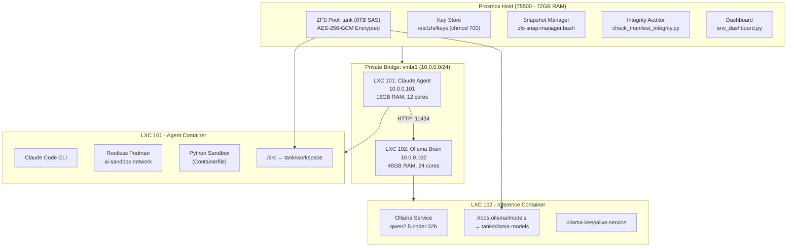
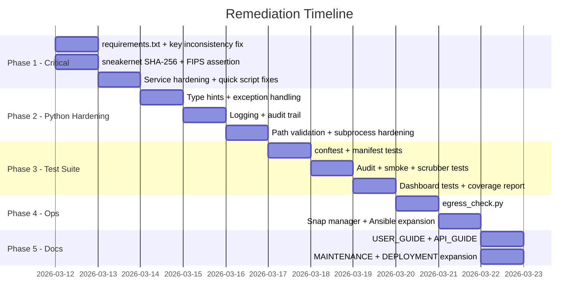

# Gap Analysis & Remediation Plan
## Project: Air-Gapped AI Development Station (`OnPremisClaudeCode`)
**Analyst:** Senior Python Developer / Architect Review  
**Date:** 2026-03-11  
**Standard References:** NIST 800-53, FIPS 140-3, DISA STIG, CIS Benchmark Level 2, OWASP, PEP 8

---

## Executive Summary

The project is a well-conceived air-gapped AI development environment built on Proxmox VE 9.1 with a thoughtful security posture. However, the current state has **17 identified gaps** across five categories: Python code quality, security hardening, operational completeness, documentation, and infrastructure configuration. Most gaps are low-to-medium effort to address and none require architectural changes.

---

## Architecture Overview (Current State)



---

## Gap Analysis

### Category 1: Python Code Quality & Standards

#### GAP-PY-01: No Type Hints on Any Python Files
**Severity:** Medium  
**Files Affected:** All `.py` files  
**Finding:** None of the five Python scripts use type annotations. Per PEP 484/526 and good security practice (fail fast on bad input), all function signatures should be annotated.  
**Example from `check_manifest_integrity.py`:**
```python
# Current (no types)
def verify_file(item):

# Should be
def verify_file(item: dict[str, str]) -> str:
```

#### GAP-PY-02: Bare `except` Clauses and Silent Failure
**Severity:** High  
**Files Affected:** `env_dashboard.py`, `security_compliance_audit.py`  
**Finding:** Multiple bare `except:` blocks silently swallow errors and return "UNKNOWN" or "N/A" with no logging. This masks real failures in a compliance environment.  
**Example from `env_dashboard.py`:**
```python
except:
    return "Health: UNKNOWN"  # ← swallows ALL exceptions silently
```

#### GAP-PY-03: No Structured Logging
**Severity:** Medium  
**Files Affected:** All `.py` files  
**Finding:** All scripts use raw `print()` statements. In an air-gapped security environment, structured logging to syslog or a file with timestamps and severity levels is required for audit trails (NIST AU-2, AU-3).

#### GAP-PY-04: No `requirements.txt` or `pyproject.toml`
**Severity:** High  
**Files Affected:** Project root (missing)  
**Finding:** The `CLAUDE.md` references `pip install --no-index --find-links=/local/packages -r requirements.txt` but **no `requirements.txt` file exists in the project**. The `smoke_test_agent.py` imports `requests` — this dependency is undeclared. The air-gapped install will silently fail.

#### GAP-PY-05: No Test Suite (`tests/` directory)
**Severity:** High  
**Files Affected:** Project root (missing)  
**Finding:** `CLAUDE.md` references `pytest tests/` but **no `tests/` directory and no test files exist**. The five Python scripts have zero automated test coverage.

#### GAP-PY-06: `subprocess` Usage Without Shell Injection Protection
**Severity:** High  
**Files Affected:** `env_dashboard.py`, `security_compliance_audit.py`, `smoke_test_agent.py`  
**Finding:** `subprocess.check_output()` and `subprocess.run()` are used with list arguments (correct), but there is no validation of inputs fed to these commands and bare `except` blocks mask failures. Also `security_compliance_audit.py` uses `os.listdir()` on an external path without path traversal protection.

#### GAP-PY-07: `telemetry_scrubber.py` Auto-Delete is Commented Out
**Severity:** Medium  
**Files Affected:** `telemetry_scrubber.py`  
**Finding:** The `os.remove()` line is commented out with a note to "Uncomment to auto-delete". This means the script only reports but never acts — creating a false sense of security. It needs a `--dry-run` / `--execute` flag pattern.

---

### Category 2: Security Hardening Gaps

#### GAP-SEC-01: `.claude.env` Committed to Git Scope
**Severity:** Critical  
**Files Affected:** `.gitignore`, `.claude.env`  
**Finding:** `.claude.env` contains `ANTHROPIC_API_KEY="ollama"` and `ANTHROPIC_BASE_URL`. The `.gitignore` correctly excludes `.claude.env`, but the file currently **exists in the project root alongside the git-tracked files** with no `.git/` directory present. If this folder is ever initialised as a git repo, the env file will be staged before `.gitignore` is committed. The ANTHROPIC_API_KEY value `"ollama-local-token"` in `claude-launch.bash` also differs from `.claude.env`'s `"ollama"` — an inconsistency that could cause auth failures.

#### GAP-SEC-02: `zfs-key-manager.sh` Uses `/dev/urandom` Not FIPS-Validated Source
**Severity:** High  
**Files Affected:** `zfs-key-manager.sh`  
**Finding:** Key generation uses `dd if=/dev/urandom` directly. Under FIPS 140-3, key material must be generated using a FIPS-validated DRBG (Deterministic Random Bit Generator). On a FIPS-enabled kernel `/dev/urandom` is backed by the FIPS DRBG, but this is not verified programmatically. The script should assert FIPS mode is active before proceeding with key generation.

#### GAP-SEC-03: `sneakernet-update.bash` Has No Integrity Verification
**Severity:** Critical  
**Files Affected:** `sneakernet-update.bash`  
**Finding:** Model weights and Podman images are copied from USB with no SHA-256/GPG signature verification before deployment. This is a supply chain attack vector. The `DEPLOYMENT.md` mentions "Generate SHA256 checksum" as a manual step but the script does not enforce it.

#### GAP-SEC-04: `ollama-keepalive.service` Runs as Root
**Severity:** High  
**Files Affected:** `ollama-keepalive.service`  
**Finding:** The systemd unit has no `User=` or `Group=` directive, defaulting to root execution. This violates CIS and DISA STIG least-privilege requirements. Ollama should run as a dedicated service account.

#### GAP-SEC-05: No Network Egress Verification Script
**Severity:** Medium  
**Files Affected:** Missing  
**Finding:** There is no automated check confirming that no packets leave `vmbr1`. The PRD claims "Zero Leakage" as a success metric, but there is no script or test that actively verifies this (e.g., checking iptables/nftables rules, asserting no gateway on `vmbr1`).

#### GAP-SEC-06: `security_compliance_audit.py` Has No Output File / Audit Trail
**Severity:** Medium  
**Files Affected:** `security_compliance_audit.py`  
**Finding:** The audit script prints to stdout only. Results are not persisted to a timestamped log file. Per NIST AU-9 and CIS controls, audit logs must be protected and retained.

---

### Category 3: Operational & Infrastructure Gaps

#### GAP-OPS-01: `deploy-env.yml` Is Incomplete Ansible Playbook
**Severity:** High  
**Files Affected:** `deploy-env.yml`  
**Finding:** The Ansible playbook only covers ZFS ARC and FIPS grub settings. It is missing: LXC container creation, ZFS dataset creation with encryption, bind-mount configuration, service installation (systemd units), and Podman image loading. It also references a `kernel_parameter` module that is not a standard Ansible module — likely a custom/community module that is undocumented.

#### GAP-OPS-02: `policy.yml` Has No Enforcement Mechanism
**Severity:** Medium  
**Files Affected:** `policy.yml`, `zfs-snap-manager.bash`  
**Finding:** `policy.yml` defines snapshot retention policy but `zfs-snap-manager.bash` does not read this file — it takes manual `TARGET` and `KEEP` arguments. The policy is documentation only with no enforcement linkage.

#### GAP-OPS-03: `zfs-snap-manager.bash` Has No Pruning Safety Check
**Severity:** Medium  
**Files Affected:** `zfs-snap-manager.bash`  
**Finding:** The pruning loop `head -n -"$KEEP"` can silently produce unexpected results if `$KEEP` is empty or non-numeric. No input validation exists. A bug here could destroy all snapshots.

#### GAP-OPS-04: No Health Check for Ollama Model Availability
**Severity:** Low  
**Files Affected:** `smoke_test_agent.py`  
**Finding:** The smoke test verifies Ollama is reachable but does not verify the specific model (`qwen2.5-coder:32b`) is loaded and responding correctly. The API endpoint `/api/generate` is tested but not the `/api/tags` endpoint to confirm model presence.

---

### Category 4: Documentation Gaps

#### GAP-DOC-01: No User Guide / Runbook
**Severity:** Medium  
**Files Affected:** Missing  
**Finding:** No `USER_GUIDE.md` or `RUNBOOK.md` exists. Day-to-day operational procedures (how to start a session, run an audit, load a new model, rotate keys) are scattered across multiple files with no unified walkthrough for operators.

#### GAP-DOC-02: No API Guide for Ollama Integration
**Severity:** Low  
**Files Affected:** Missing  
**Finding:** No documentation exists describing the Ollama API contract, available endpoints, model parameters, or how the `ANTHROPIC_BASE_URL` redirect works. This is important for developers and for compliance evidence.

#### GAP-DOC-03: `MAINTENANCE.md` Is Skeletal
**Severity:** Medium  
**Files Affected:** `MAINTENANCE.md`  
**Finding:** The maintenance document covers only ZFS scrub and key rotation. Missing: LXC update procedures, Python dependency updates (offline), Podman image refresh cycle, log rotation procedures, and disk capacity thresholds.

#### GAP-DOC-04: `DEPLOYMENT.md` Lacks Rollback Procedures
**Severity:** Medium  
**Files Affected:** `DEPLOYMENT.md`  
**Finding:** The deployment guide describes sideloading but has no rollback procedure if a model or image is corrupt or causes failure. ZFS snapshot-based rollback is not documented.

---

## Gap Summary Table

| ID | Category | Severity | Description | Effort |
|---|---|---|---|---|
| GAP-PY-01 | Python Quality | Medium | No type hints | Low |
| GAP-PY-02 | Python Quality | **High** | Bare except / silent failure | Low |
| GAP-PY-03 | Python Quality | Medium | No structured logging | Medium |
| GAP-PY-04 | Python Quality | **High** | Missing requirements.txt | Low |
| GAP-PY-05 | Python Quality | **High** | No test suite | High |
| GAP-PY-06 | Python Quality | **High** | subprocess input validation | Medium |
| GAP-PY-07 | Python Quality | Medium | telemetry_scrubber dry-run flag | Low |
| GAP-SEC-01 | Security | **Critical** | .claude.env key inconsistency | Low |
| GAP-SEC-02 | Security | **High** | FIPS assertion before key gen | Low |
| GAP-SEC-03 | Security | **Critical** | No integrity check in sneakernet | Medium |
| GAP-SEC-04 | Security | **High** | Ollama service running as root | Low |
| GAP-SEC-05 | Security | Medium | No network egress verification | Medium |
| GAP-SEC-06 | Security | Medium | No persistent audit log output | Low |
| GAP-OPS-01 | Operations | **High** | Incomplete Ansible playbook | High |
| GAP-OPS-02 | Operations | Medium | policy.yml not enforced | Medium |
| GAP-OPS-03 | Operations | Medium | zfs-snap-manager no input validation | Low |
| GAP-OPS-04 | Operations | Low | Smoke test missing model check | Low |
| GAP-DOC-01 | Docs | Medium | No User Guide / Runbook | Medium |
| GAP-DOC-02 | Docs | Low | No Ollama API Guide | Low |
| GAP-DOC-03 | Docs | Medium | Skeletal MAINTENANCE.md | Medium |
| GAP-DOC-04 | Docs | Medium | No rollback in DEPLOYMENT.md | Low |

---

## Proposed Remediation Plan

### Phase 1 — Critical & Quick Wins (Estimated: 1–2 days)
> Zero architectural impact. Fix highest-risk items first.

| Step | Action | Gaps Addressed |
|---|---|---|
| 1.1 | Create `requirements.txt` with pinned versions | GAP-PY-04 |
| 1.2 | Add FIPS assertion to `zfs-key-manager.sh` before `dd` | GAP-SEC-02 |
| 1.3 | Add SHA-256 verification to `sneakernet-update.bash` | GAP-SEC-03 |
| 1.4 | Add `User=ollama` + `Group=ollama` to `ollama-keepalive.service` | GAP-SEC-04 |
| 1.5 | Resolve `.claude.env` vs `claude-launch.bash` API key inconsistency | GAP-SEC-01 |
| 1.6 | Add `--dry-run` / `--execute` flag to `telemetry_scrubber.py` | GAP-PY-07 |
| 1.7 | Add input validation to `zfs-snap-manager.bash` | GAP-OPS-03 |
| 1.8 | Add model presence check to `smoke_test_agent.py` | GAP-OPS-04 |

### Phase 2 — Python Code Hardening (Estimated: 2–3 days)
> Improve all Python scripts to meet PEP 8, type hint, logging, and security standards.

| Step | Action | Gaps Addressed |
|---|---|---|
| 2.1 | Add type hints to all Python files | GAP-PY-01 |
| 2.2 | Replace bare `except` with specific exceptions + logging | GAP-PY-02 |
| 2.3 | Introduce `logging` module (file + syslog handler) to all scripts | GAP-PY-03 |
| 2.4 | Add path validation / sanitisation to `security_compliance_audit.py` | GAP-PY-06 |
| 2.5 | Add timestamped JSON output to `security_compliance_audit.py` | GAP-SEC-06 |

### Phase 3 — Test Suite (Estimated: 2–3 days)
> Build `tests/` directory with pytest coverage for all Python scripts.

| Step | Action | Gaps Addressed |
|---|---|---|
| 3.1 | Create `tests/` directory + `conftest.py` | GAP-PY-05 |
| 3.2 | Unit tests for `check_manifest_integrity.py` | GAP-PY-05 |
| 3.3 | Unit tests for `security_compliance_audit.py` | GAP-PY-05 |
| 3.4 | Unit tests for `smoke_test_agent.py` (mocked) | GAP-PY-05 |
| 3.5 | Unit tests for `telemetry_scrubber.py` | GAP-PY-05 |
| 3.6 | Unit tests for `env_dashboard.py` | GAP-PY-05 |

### Phase 4 — Operational Improvements (Estimated: 1–2 days)
> Close operational gaps in scripts and YAML configurations.

| Step | Action | Gaps Addressed |
|---|---|---|
| 4.1 | Create `egress_check.py` — verifies no gateway on vmbr1 | GAP-SEC-05 |
| 4.2 | Refactor `zfs-snap-manager.bash` to read `policy.yml` | GAP-OPS-02 |
| 4.3 | Expand `deploy-env.yml` with complete LXC + ZFS provisioning tasks | GAP-OPS-01 |

### Phase 5 — Documentation Completion (Estimated: 1 day)
> Fill all documentation gaps.

| Step | Action | Gaps Addressed |
|---|---|---|
| 5.1 | Create `USER_GUIDE.md` — daily operator runbook | GAP-DOC-01 |
| 5.2 | Create `API_GUIDE.md` — Ollama API reference | GAP-DOC-02 |
| 5.3 | Expand `MAINTENANCE.md` — full lifecycle procedures | GAP-DOC-03 |
| 5.4 | Expand `DEPLOYMENT.md` — add ZFS rollback procedures | GAP-DOC-04 |

---

## Delivery Sequence Diagram



---

## Files To Be Created (New)

| Filename | Phase | Purpose |
|---|---|---|
| `requirements.txt` | 1 | Pinned offline-installable Python dependencies |
| `tests/conftest.py` | 3 | pytest fixtures and shared test infrastructure |
| `tests/test_check_manifest.py` | 3 | Tests for integrity checker |
| `tests/test_security_audit.py` | 3 | Tests for compliance auditor |
| `tests/test_smoke_test.py` | 3 | Tests for smoke test (mocked requests/subprocess) |
| `tests/test_telemetry_scrubber.py` | 3 | Tests for scrubber |
| `tests/test_env_dashboard.py` | 3 | Tests for dashboard |
| `egress_check.py` | 4 | Network air-gap verification script |
| `USER_GUIDE.md` | 5 | Operator daily runbook |
| `API_GUIDE.md` | 5 | Ollama/Claude API integration reference |

## Files To Be Modified (Existing)

| Filename | Phase | Changes |
|---|---|---|
| `requirements.txt` | 1 | Create with: `requests`, `pytest` |
| `claude-launch.bash` | 1 | Align API key with `.claude.env` |
| `zfs-key-manager.sh` | 1 | Add FIPS pre-check |
| `sneakernet-update.bash` | 1 | Add SHA-256 verification |
| `ollama-keepalive.service` | 1 | Add `User=` / `Group=` |
| `zfs-snap-manager.bash` | 1 | Add input validation |
| `smoke_test_agent.py` | 1+2 | Model presence check, type hints, logging |
| `check_manifest_integrity.py` | 2 | Type hints, logging, specific exceptions |
| `security_compliance_audit.py` | 2 | Type hints, logging, JSON output, path validation |
| `env_dashboard.py` | 2 | Type hints, specific exceptions, logging |
| `telemetry_scrubber.py` | 2 | Type hints, `--dry-run`/`--execute` argparse |
| `deploy-env.yml` | 4 | Expand with full provisioning playbook |
| `MAINTENANCE.md` | 5 | Full lifecycle procedures |
| `DEPLOYMENT.md` | 5 | ZFS rollback + emergency procedures |

---

## Risk Register

| Risk | Likelihood | Impact | Mitigation |
|---|---|---|---|
| Sneakernet supply chain compromise | Medium | Critical | Phase 1 SHA-256 fix |
| Ollama root escalation | Low | High | Phase 1 service user fix |
| Silent Python failure masking compliance state | High | High | Phase 2 exception handling |
| Test-less scripts causing regression on update | High | Medium | Phase 3 test suite |
| Policy drift (snapshots not following policy.yml) | Medium | Medium | Phase 4 script linkage |

---

*Document generated: 2026-03-11 | Review cycle: After each phase completion*
